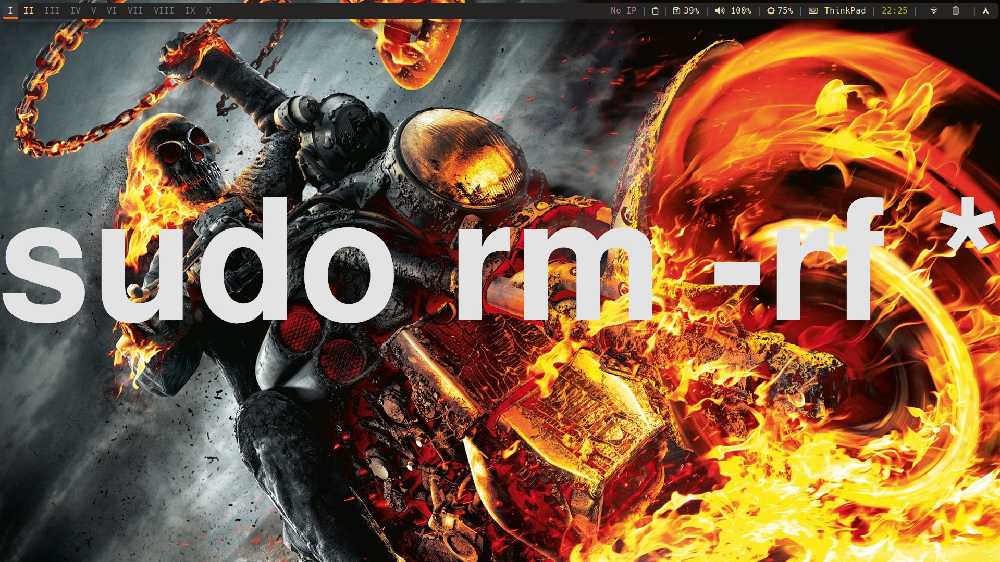

# dotfilesBspwm  
🎛️ **Mis configuraciones para bspwm en Arch Linux**  

## Programas Principales
Rofi, Polybar, Bspwm, Sxhkd, kitty, zsh

## Capturas de pantalla  



## Descarga  

```sh
git clone https://github.com/Diego11879/dotfilesBspwm.git  
```
## Rutas
.dotfiles/
├── bspwm/        # Co:nfiguración de bspwm
├── sxhkd/        # Atajos de teclado
├── polybar/      # Configuración de Polybar
├── rofi/         # Menú estilo Rofi
├── picom/        # Compositor para transparencias y sombras
└── scripts/      # Scripts útiles
